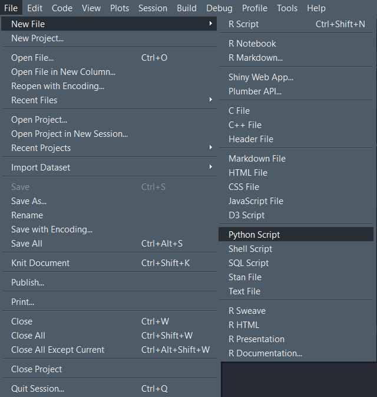
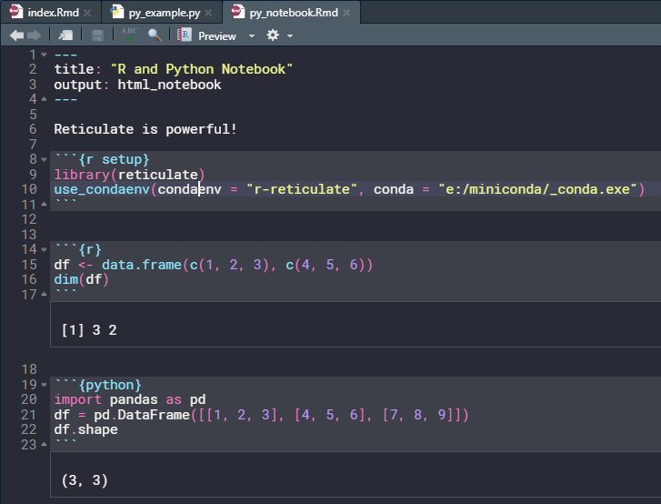

If you are like me and have been using `R` for a long time but would like to explore and add some python capabilities to your workflows, [reticulate](https://rstudio.github.io/reticulate/) + [R-Studio](https://www.rstudio.com/) is a great way to achieve just that.

Here's a quick excerpt from reticulate's website:

>The reticulate package provides a comprehensive set of tools for interoperability between Python and R.

Essentially, reticulate allows R to talk to Python (via a live python session running in the background) and works seamlessly within RStudio. It also provides functionality to manage multiple python installations. In this post, we'll explore how to set up a python environment and configure the same to work with RStudio in windows. Let's dive in! 

## Installing Python

The first step, ofcourse, is to install the `reticulate` package.


```r
install.packages("reticulate")
```

Next, we will install python via reticulate. For windows, if installing python via `reticulate`, it's better to install `miniconda` since reticulate only uses `conda` to install and manage python libraries. If you'd rather use a bare bones installation of python, it would be a lot easier to directly install python using the windows binary, go through the installation process, use `pip` from either the command prompt or Power Shell to install the libraries you need and then point reticulate to that installation of python using `use_python()`. See [here](https://rstudio.github.io/reticulate/reference/use_python.html) for more details.

This post will use [Miniconda](https://docs.conda.io/en/latest/miniconda.html). By default, a virtual environment called `r-reticulate` will also be created as part of the installation process.


```r
library(reticulate)
install_miniconda(path = "e:/miniconda", update = T)
```

## Pointing to the right python installation

Now that Miniconda is installed, we need to point reticulate to it. First, let's check if the `r-reticulate` virtual environment is available.


```r
conda_list(conda = "e:/miniconda/_conda.exe")
##           name                                        python
## 1 r-reticulate E:\\miniconda\\envs\\r-reticulate\\python.exe
```

If available, then point to it using `use_condaenv()`. This binds the particular installation of Python to the current R session. 

**Note** that if you restart R, this will need to be set again. To set it permanently set the `RETICULATE_PYTHON` environment variable using `Sys.setenv()`.


```r
use_condaenv(condaenv = "r-reticulate", conda = "e:/miniconda/_conda.exe")
```

If the default virtual environment is not available, or you would like to create a new one, then use `conda_create()`


```r
conda_create(envname = "myenv", conda = "e:/miniconda/_conda.exe")
```

## Installing libraries

Now that `reticulate` nows where to find python, we can install some python libraries to work with. 


```r
py_install(packages = c("pandas", "scikit-learn"))
```

## Using Python within R-Studio

If all of the above steps worked without any errors, you should be able to do something like this in a new R session (console or R-script). 

```r
pd <- import("pandas")
pd$array(c(1, 2, 3))
## <PandasArray>
## [1.0, 2.0, 3.0]
## Length: 3, dtype: float64
```
Yay! Python and R are now talking to each other :clap:

Now, that everything is setup, there are multiple ways to use python along with R inside RStudio: 

One can R-Studio as an IDE for python. Simply open up a new python script from `File -> New File -> Python Script` and start to write some python code. 




Another way to use python inside RStudio is via `R-Notebooks`. Simply launch a new `R-Notebook` and start to write python code inside a python code chunk. This way, one can use Python and R within the same notebook. :smirk:



Possibly the most exciting way of using Python with R is to import Python functions into R. This is a great way to add python functionality to an existing R environment. 

- We'll need a python script to house python code including functions that need to be imported into R
- We can then import the above functions via `source_python()`

As an example, say we have a python script called `py_example.py` with the following code which allows us to fit a linear regression model using `scikit-learn`. 


```python
from sklearn import linear_model
linreg_python = linear_model.LinearRegression()
```

We can import this function into R by simply running:


```r
source_python("py_example.py")
```

And now we can use this function inside R as we would use any other function (note that syntax is different however). 


```r
# Fit model 
linreg_python$fit(X = mtcars[,-1], y = mtcars$mpg)
## LinearRegression(copy_X=True, fit_intercept=True, n_jobs=None, normalize=False)
```


```r
# Show coefficients
data.frame(var = c("Intercept", names(mtcars)[-1]), 
           python_coef = c(linreg_python$intercept_, linreg_python$coef_))
##          var python_coef
## 1  Intercept 12.30337416
## 2        cyl -0.11144048
## 3       disp  0.01333524
## 4         hp -0.02148212
## 5       drat  0.78711097
## 6         wt -3.71530393
## 7       qsec  0.82104075
## 8         vs  0.31776281
## 9         am  2.52022689
## 10      gear  0.65541302
## 11      carb -0.19941925
```

Just for fun, let's also compare the output from good old `lm()`


```r
# Fit model and show coefficients from R
fit <- lm(mpg ~ ., data = mtcars)
data.frame(R_coef = coef(fit))
##                  R_coef
## (Intercept) 12.30337416
## cyl         -0.11144048
## disp         0.01333524
## hp          -0.02148212
## drat         0.78711097
## wt          -3.71530393
## qsec         0.82104075
## vs           0.31776281
## am           2.52022689
## gear         0.65541302
## carb        -0.19941925
```

Using the above set-up, one could combine python's extensive ML capabilities and R's intuitive data munging and excellent data visualisation capabilities into one single powerful workflow. I wonder if **Py-ThoR** would be an appropriate name for such a workflow? :punch:

*Thoughts? Comments? Helpful? Not helpful? Like to see anything else added in here? Let me know!*

